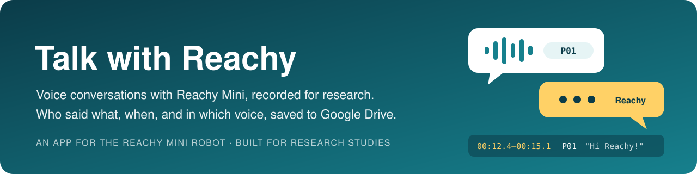

<p align="center">
  
</p>

<p align="center">
  <a href="#what-the-app-does">What it does</a> ·
  <a href="#a-study-session-step-by-step">A study session</a> ·
  <a href="#how-it-works">How it works</a> ·
  <a href="#what-gets-recorded">What gets recorded</a> ·
  <a href="#privacy-and-responsibility">Privacy</a> ·
  <a href="#try-it">Try it</a> ·
  <a href="STUDY_SETUP.md">Study setup guide</a>
</p>

**Talk with Reachy** is an app for [Reachy Mini](https://github.com/pollen-robotics/reachy_mini), a small robot by Pollen Robotics. People talk with Reachy by voice, as they do in Pollen's official conversation app. While they talk, the app keeps a research record of the conversation: what was said, when it was said, and who said it, recognized by voice. The app was built for research studies.

A sister app, **[Talk with Reachy Math](https://github.com/renkaima/talk_with_reachy_math)**, adds spoken math games for children aged 10 to 13 on top of everything described here.

> [!IMPORTANT]
> **This app records.** By default it saves what everyone near the robot says, an audio clip of each utterance, and a voiceprint of each voice. Whoever installs it is responsible for telling people and getting their consent; see [Privacy and responsibility](#privacy-and-responsibility).

## What the app does

**For the people who talk with Reachy**

- They talk naturally, and Reachy answers aloud in one or two sentences.
- Reachy moves its head, shows emotions, and can dance, look through its camera, or check the weather.
- Reachy recognizes who is speaking, uses their name, and remembers things about each person separately. It is instructed never to tell one person what it remembers about another.

**For the researcher**

- Every utterance, by a person or by Reachy, is logged with its start time, end time, and duration.
- Each person utterance is labeled with a speaker ID found by voice: `P01` for a participant the researcher enrolled, or `V003` for a voice the app learned on its own.
- The audio of each person utterance is saved as a WAV clip, so a researcher can check the speaker labels by ear.
- Robot actions, people talking over Reachy, and connection problems are logged on the same timeline.
- The robot uploads all of it to a Google Drive folder every five minutes. No computer needs to be nearby.

## A study session, step by step

| When | Who | What happens |
|---|---|---|
| **Before** | Researcher | Installs the app on the robot from the Reachy Mini Control app, signs the robot in to Google Drive once, and enrolls each participant's voice (about 20 seconds of speech per person). |
| **During** | Participants | Talk with Reachy. Reachy greets them, answers, and addresses each person by name once it recognizes their voice. |
| **After** | Researcher | Opens the Google Drive folder. It holds one transcript per app run (JSONL and CSV), one audio clip per person utterance, and one folder per person. The same files stay on the robot. |

## How it works

<p align="center">
  
</p>

1. **The conversation works as in Pollen's app.** The microphone streams audio to a speech service on Hugging Face (by default, the server that Pollen Robotics hosts). The service turns speech into text, a language model writes Reachy's reply and chooses its movements, and speech synthesis speaks the reply through the robot.
2. **Voice ID runs on the device.** The app keeps a copy of the audio it sends. When the speech service reports where an utterance started and ended, the app cuts out that piece and computes a voiceprint with NVIDIA's TitaNet-S speaker model, run locally with [sherpa-onnx](https://github.com/k2-fsa/sherpa-onnx). It compares the voiceprint with the known voices and assigns a speaker ID.
3. **Reachy is told who is speaking.** When the speaker changes, the app sends the language model a note that is not spoken aloud. The note names the person, if their name is known, and lists what Reachy remembered about them. Reachy's `remember` and `forget` tools then change that person's own memory file.
4. **The study recorder writes one record per utterance:** the words, the start and end times, the speaker ID and how well the voice matched, and the audio clip. Robot actions and other events go into the same file.
5. **The uploader copies the data folder to Google Drive** every five minutes. Without internet, the files wait on the robot and upload later.

## What gets recorded

Everything goes into one data folder, `~/talk_with_reachy_data/` on the robot (or on the Mac, in the simulation):

```
talk_with_reachy_data/
├── transcripts/<robot>_<date-time>_<id>.jsonl   one file per app run
├── transcripts/<same name>.csv                  the same timeline as a spreadsheet
├── audio/<same name>/<seq>_<speaker ID>.wav     one clip per person utterance
├── people/library.json                         voiceprints of all known voices
└── people/<speaker ID>/memory.v1.json           what Reachy remembers about each person
```

One utterance in the transcript looks like this (one line in the file, spread out here):

```json
{
  "session_id": "9f2c…",
  "type": "utterance",
  "seq": 1,
  "time": "2026-10-01 09:00:16.020-04:00",
  "start": "2026-10-01 09:00:13.101-04:00",
  "end": "2026-10-01 09:00:15.870-04:00",
  "duration_s": 2.769,
  "elapsed_s": 0.756,
  "speaker": "person",
  "speaker_id": "P01",
  "speaker_name": "Alice",
  "match_score": 0.712,
  "id_status": "matched",
  "audio_file": "audio/reachy-mini_20261001-090012_9f2c12/0001_P01.wav",
  "text": "Hi Reachy, what are you doing?"
}
```

[STUDY_SETUP.md](STUDY_SETUP.md#what-is-recorded) describes every field and event.

## Privacy and responsibility

Talk with Reachy is a research tool, and it records by default. For everyone who speaks near the robot, it saves the words, the times, an audio clip of each utterance, and a voiceprint, which some laws treat as biometric data. These files stay on the device. They leave it only for the Google Drive of the person who signs the robot in to Google; the maintainer of this app never receives them. As in Pollen's app, the microphone audio is also streamed to the speech service on Hugging Face, and with this app the hidden notes also send it people's names and what Reachy remembers about them.

Whoever installs and runs the app chooses to record, and is responsible for:

- telling everyone near the robot that they are being recorded, and getting their consent;
- following the laws that apply where the robot is used, such as rules on recording conversations and on biometric data;
- keeping the recordings safe, and deleting a person's data when they ask ([how](STUDY_SETUP.md#managing-voices)).

To record less, set `TALK_WITH_REACHY_SAVE_AUDIO=0` (no audio clips), `TALK_WITH_REACHY_VOICE_ID=0` (no voiceprints), or `TALK_WITH_REACHY_LOGGING=0` (no study records at all); see [Settings](STUDY_SETUP.md#settings). To keep the audio on your own hardware, run your own speech service ([connection modes](docs/ORIGINAL_README.md#hugging-face-connection-modes)).

The app is provided "as is", without warranty of any kind, under the [Apache 2.0 license](LICENSE).

## Try it

**In the simulation, without a robot.** Start the simulation in the Reachy Mini Control app on a Mac, install Talk with Reachy, and talk through the Mac's microphone. The app writes transcripts, speaker IDs, and audio clips to `~/talk_with_reachy_data` on the Mac. To test the Google Drive upload as well, sign the Mac in once with `bash deploy/google_dry_run.sh` ([details](STUDY_SETUP.md#5-sign-in-to-google-drive-one-time-per-device)).

**On a Reachy Mini.** Open the app store in the Reachy Mini Control app, search for *Talk with Reachy*, and click **Install**. The app records on the robot from the first conversation. Google Drive upload works only for Google accounts that the maintainer has added as testers, so on other robots the files stay on the device. [STUDY_SETUP.md](STUDY_SETUP.md#setup-in-order) lists every setup step for a study, from enrolling participants to checking the upload.

**From source, for developers.** The [developer reference](docs/ORIGINAL_README.md) covers installing from source, configuration, and command-line options; here the command is `talk-with-reachy`. The Google client secret is not in this repository, so a copy run from source keeps its study files on the device.

## Good to know

- **Check voice ID before relying on it.** The voice-matching thresholds come from a check on clean recordings of six speakers, not on any study population or in a noisy room. Run a pilot in which an observer notes who speaks, and compare the notes with the transcript ([details](STUDY_SETUP.md#voice-identification)).
- **One label per utterance.** When two people talk in the same turn, the utterance is labeled with the voice that dominates it, or `unknown`.
- **The Python package is `talk_with_reachy`,** so the app installs next to Pollen's official conversation app on the same robot without replacing it.

## Credits and license

- Built on Pollen Robotics' [reachy_mini_conversation_app](https://github.com/pollen-robotics/reachy_mini_conversation_app) (Apache 2.0). The changes are the commits after upstream commit `5eb39ed`. This app is not affiliated with or endorsed by Pollen Robotics; "Reachy Mini" names the robot that the app runs on.
- Voice ID uses NVIDIA NeMo's TitaNet-S speaker model through [sherpa-onnx](https://github.com/k2-fsa/sherpa-onnx).
- Maintained by Renkai Ma ([@renkaima](https://github.com/renkaima)).
- License: Apache 2.0, see [LICENSE](LICENSE).
